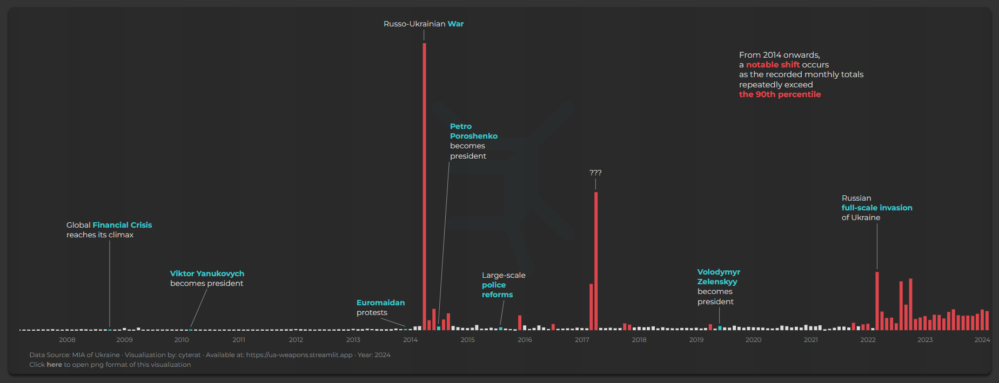

# ⚔️Lost and Stolen Weapons in Ukraine  (1991-2023)

<https://ua-weapons.streamlit.app/>

&nbsp;&nbsp;&nbsp;&nbsp;&nbsp;&nbsp;I began working on this project at the end of 2021, when I stumbled upon **MIA** (Ministry of Internal Affairs) **of Ukraine** data, believing that it may potentially uncover how weapons theft and loss fit into the "terraforming" processes of the country as a political entity.

&nbsp;&nbsp;&nbsp;&nbsp;&nbsp;Some peculiar changes occur throughout the history of Ukraine, which may or may not correlate with particular events, some of which I included as the barchart annotations near the top of the webpage. Therefore, I would recommend viewing these annotations as time markers rather than events tied to the numbers.

&nbsp;&nbsp;&nbsp;&nbsp;&nbsp;*It is worth noting that this project is by no means a statistical analysis but rather a visual representation of the dataset, which some of you might find interesting, just as I did.*

*Visualization Example*

## 💾Data

- The **original dataset** can be accessed at [data.gov.ua](https://data.gov.ua/en/dataset/5e7a9e93-e4ae-408a-8b99-6a21bfa9c12a/resource/1fcab772-0b3c-4938-8f72-e60db343cbe5)

- The jupyter notebook which was used during IDE and then transformed into a separate pipeline script can be found in my [notebooks repository](https://github.com/cyterat/notebooks)

## 🚧Latest Changes

Restructure pipeline for performance and maintainability

- Split monolithic 400+ line pipeline into modular ETL structure

- Replace pandas with polars for processing optimization:
    - __Processing time reduced by ~90%__ >>> ~~300 sec~~ > 30 sec 

- Separate data extraction/transformation from SQL-based analytical modeling

- Create modeling (materialization) layer with SQL templates and DuckDB execution:
    - __Processing time reduced by ~75%__ >>> ~~40 sec~~ > 10 sec

- Move from print() to proper logging with YAML configuration

- Organize data into structured marts/models/raw/processed directories

- Update CI workflows and app paths for new architecture

The entire data updating pipeline now runs approximately __6x faster__ than its previous implementation, i.e. __processing time reduced by ~83%__ >>> ~~6 min~~ > 1 min.
  
## 🛠 Libraries

Polars, DuckDB, PyYAML, Pandas, NumPy, Matplotlib, Plotly, Streamlit
